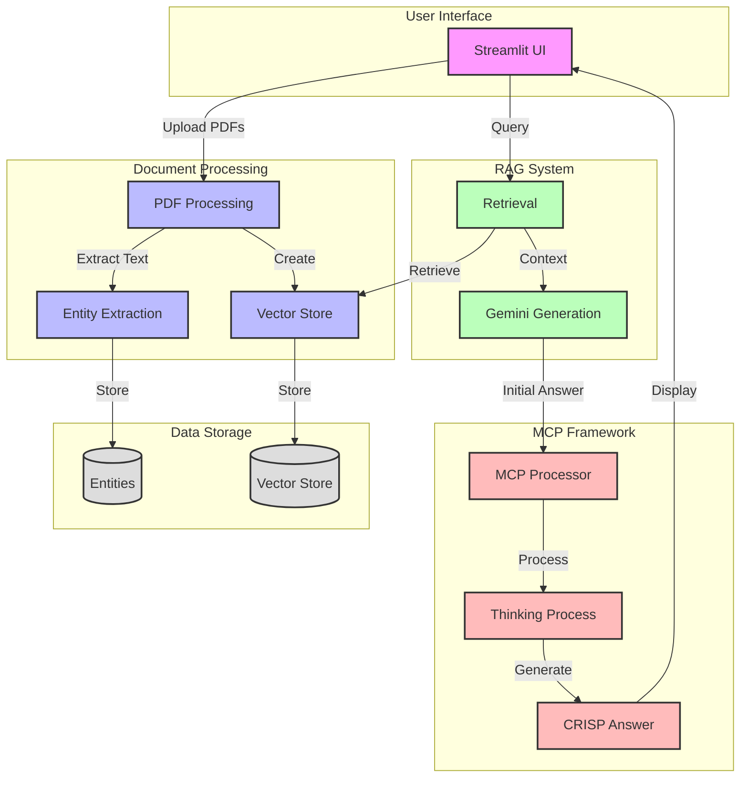

# Invoice Processing RAG System with MCP Framework

## Architecture Overview



## Component Descriptions

### 1. User Interface (Streamlit)
- Provides a web-based interface for document upload and querying
- Handles user interactions and displays results
- Manages session state for processed documents

### 2. Document Processing
- **PDF Processing**: Extracts text from uploaded PDF documents
- **Entity Extraction**: Identifies and extracts key entities (invoice numbers, dates, amounts, etc.)
- **Vector Store**: Creates and manages document embeddings for semantic search

### 3. RAG System
- **Retrieval**: Finds relevant document chunks based on user queries
- **Gemini Generation**: Uses Google's Gemini model to generate initial answers
- **Context Management**: Combines retrieved information with user queries

### 4. MCP Framework
- **MCP Processor**: Orchestrates the thinking process
- **Thinking Process**: Iterative refinement of answers through:
  - Question understanding
  - Information analysis
  - Insight identification
  - Precise answer formulation
- **CRISP Answer**: Generates Clear, Relevant, Insightful, Specific, Precise answers

### 5. Data Storage
- **Vector Store**: Stores document embeddings for efficient retrieval
- **Entities**: Stores extracted structured information from documents

## Data Flow

1. **Document Processing Flow**:
   - User uploads PDF documents
   - System extracts text and entities
   - Creates vector embeddings
   - Stores processed data

2. **Query Processing Flow**:
   - User submits a question
   - System retrieves relevant document chunks
   - Gemini generates initial answer
   - MCP framework processes and refines the answer
   - System displays CRISP answer with supporting information

## Key Features

- **Entity Extraction**: Automatically identifies and extracts key information from invoices
- **Semantic Search**: Uses FAISS for efficient document retrieval
- **Iterative Thinking**: MCP framework provides multi-step answer refinement
- **CRISP Answers**: Delivers clear, concise, and precise responses
- **Confidentiality**: Automatically removes sensitive information from responses

## Dependencies

- Streamlit
- PyPDF2
- FAISS
- Sentence Transformers
- Google Generative AI
- Mermaid (for diagram rendering)

## Setup

1. Clone this repository
2. Install the required dependencies:
   ```bash
   pip install -r requirements.txt
   ```

## Running the Application

To run the application locally:

```bash
streamlit run app.py
```

The application will open in your default web browser.

## Usage

The application has two modes:

### Processing Mode
1. Upload one or more PDF invoices using the file uploader
2. Click "Process Documents" to add them to the knowledge base
3. The processed documents will be saved for future use

### Query Mode
1. Ask questions about the invoices in the knowledge base
2. View the answer generated by the system

## Technical Details

- Uses Nomic embeddings directly from Hugging Face for document vectorization
- Implements FAISS for efficient similarity search and retrieval
- Processes PDF documents using PyPDF2
- Built with Streamlit for the user interface
- Runs entirely locally without external API dependencies
- Persistent storage of processed documents 